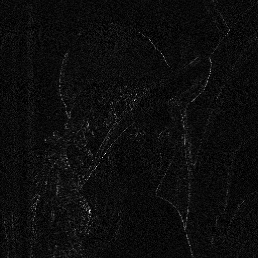
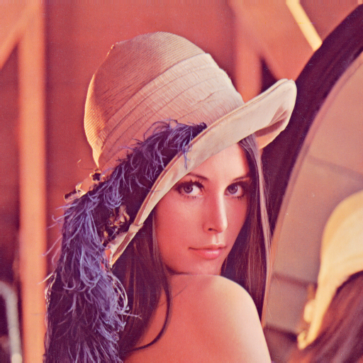
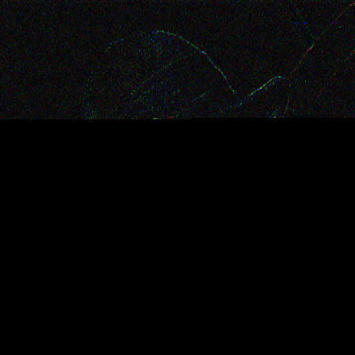

# 2024_CS-4463-steganography_semester-project

## Overview
Pixel Value Differencing steganography project, using "A steganographic method for images by pixel-value differencing" by Da-Chun Wua and Wen-Hsiang Tsai (2002) as a guide

### Pixel Value Differencing Steganography
Pixel Value Differencing is a steganography technique in which the cleartext data is stored as the difference between successive pixels.

LSB (Least Significat Bit) Steganography is relatively easy to spot, depending on how many bits are used. One of the reasons for this is that the same amount of cover-image data is overwrittten no matter where in the image. In a smooth section, like a solid color, hidden data is very easy to spot, while a chaotic section, like very quickly changing colors, hidden data is harder to spot.

The key to Pixel Value Differencing is that when two pixels already have a larger difference, we store more data in them, but when they have a small difference, we store less data. This ensures that the smoother sections stay smoother, thereby decreasing our visual detectability.

Specifically, the way this is implemented is that difference ranges are defined: `(0..7, 8..15, 16..31, …, 128..255)`. You'll notice that the smaller ranges have a smaller width (ie `0..7` has 8 numbers), while the bigger ranges have a larger width (ie `128..155` has 128 numbers). This is done to allow us to apply more change to differences that are already large, while applying a smaller change to differences that are already small
 - Let us say, for example, we have two pixels, with values `230` and `240`, and we have the 3 message bits `001` to hide.
   - `240 - 230 = 10`  --  with a difference of `10`, this falls into the above range `8..15`, meaning that after whatever changes we make, the total difference between these two pixels will still be within that range
   - expanding that range, we get `8, 9, 10, 11, 12, 13, 14, 15`. with `8` at index `0` (binary `000`), our difference, `10`, is at index `2` (binary `010`)
   - the message bits we want to hide is `001`, so we use this as the index to get the new difference:
     - binary `001` -> decimal `1` -> used as index into range gives us `9` as our new difference
   - Given our new difference `9`, we adjust the pixel values from `230` and `240` (difference `10`) to `230` and `239` (difference `9`) to reflect this
   - these steps are repeated for each pixel pair in an image.

## Installation

```bash
python3 -m pip install -r requirements.txt
```
 - Currently the only requirement is Pillow 10.4 for reading / writing the image file

## Usage

embed data into image:
```bash
python3 PVD.py -c ./test-images/lena_gray.bmp -m ./test-messages/small-msg.txt -o PVD_encoded-image.bmp
```

extract data from image:
```bash
python3 PVD.py -e PVD_encoded-image.bmp
```

hide data using randomized key, vertical pixel pairings, and color components:
```bash
python3 PVD.py -c ./test-images/lena.bmp --rgb -m ./test-messages/small-msg.txt -o PVD_encoded-image.bmp --key "mysecretkey" --vertical
```

## Examples
### Black and White embedded with `"A"`s
#### Original Image:


#### Image embedded with about 50,898 `"A"` characters:


#### Difference between cover image and stego image (difference scaled up by 10):

 - (ie, `this_img[1,1] = 10 * abs(cover_img[1,1] - stego_img[1,1])` )
 - you can see here that the entire capacity is maxed out

### Color embedded with Bee Movie script
#### Original Image:


#### Image embedded with bee movie script:


#### Difference between cover image and stego image (difference scaled up by 10):

 - you can see here that only about 30% of the capacity is used
